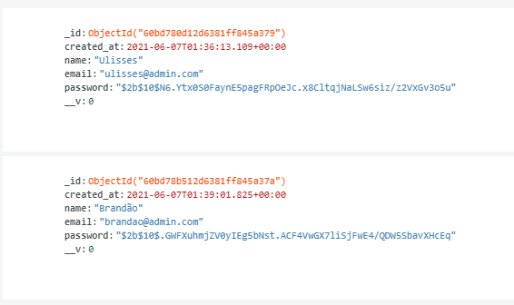

<p align="center">
  </a>
</p>

<h3 align="center">API-AUTENTICATION - MongoDB - JWT - Bcrypt</h3>

<div align="center">

[]()
[](/LICENSE)

</div>

## Apresentação:

Projeto **API**: utilizando **NodeJS** e MongoDB para persistência dos dados.

Pacotes principais: **Express** responsável pela criação de rotas, Middleware **JWT** para persistência do token por, mantendo a segurança e credêncial do usuário, Banco de dados não relacional **MongoDB** e por fim Bcrypt, para proteção das senhas.

## Instalação:

- Instalar dependência: `yarn install` ou `npm install`
- Configurar variáveis ambiente (Colocar o login do seu Cluster MongoDB): `LOGIN`
- Iniciar aplicação em produção: `yarn start`

## Rotas

#### Import insomnia: `Insomnia.json`

- [x] Registrar novo usuário

```java
routes.post('/registrar', userController.register);

{
	"name": "Ulisses",
	"email": "ulisses@admin.com",
	"password": "segredo"
}
```

- [x] Logar sessão

```java
routes.post('/login', userController.login);

{
	"email": "ulisses@admin.com",
	"password": "segredo"
}
```

- [x] Listar usuarios. Obs: Necessário JWT recebido no login

```java
routes.get('/usuarios', login.obrigatorio, userController.listarUsuarios);
```

- [x] Listar usuarios um usuário pelo ID. Obs: Necessário JWT recebido no login

```java
routes.get('/usuarios/:id', login.obrigatorio,userController.listarUsuarioId);
```

## Print Banco de dados

#### Podemos notar que o Bcrypt faz a criptografia da senha para uma senha muito mais segura, mesmo assim conseguimos comparar com a senha que o usuario informou no cadastro pois, o BCrypt adicionar um hash na senha original no momento do login e compara com a senha que está no banco de dados.

</a>

<footer><p>Feito com o ♥ por <a href="https://www.instagram.com/ulisses.brandao/">Ulisses Brandão</a>👋</p>
<p>☕Bora tomar um café e conversar melhor?</p></footer>
